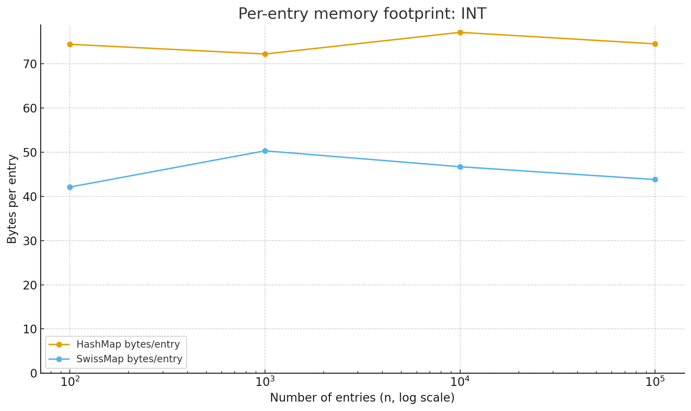
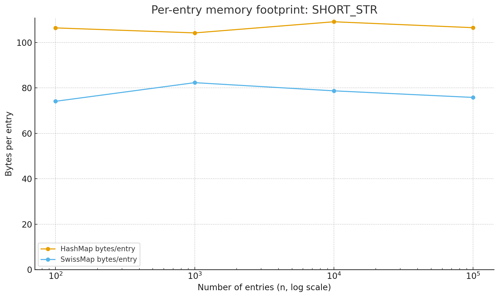
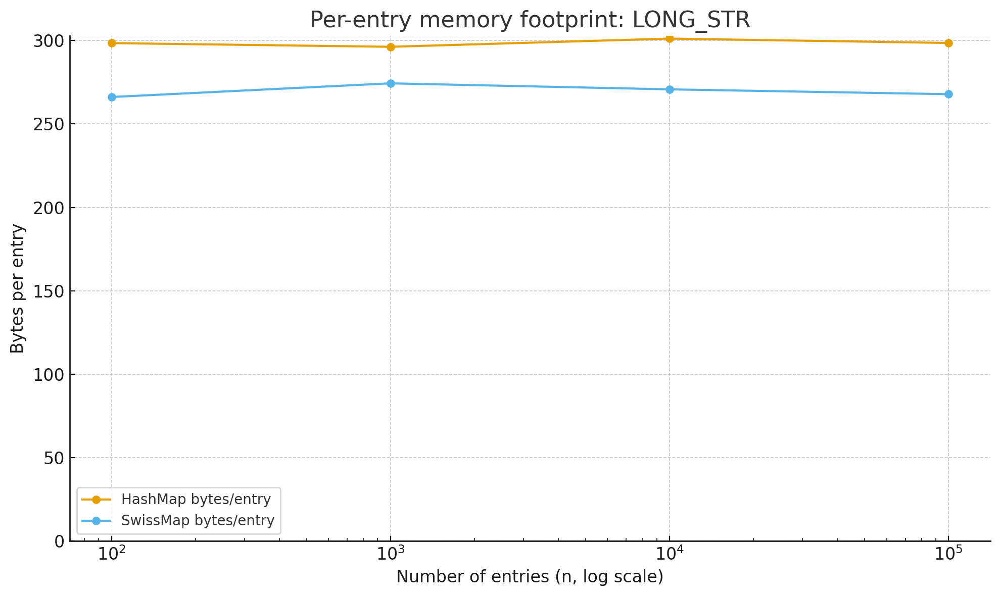

# SwissMap (HashSmith)

> SwissTable-inspired hash map with SIMD acceleration via the JDK Vector API (incubator).

## Overview
- Open addressing with fixed control bytes (`EMPTY`, `DELETED`) and tombstone reuse.
- SIMD probing on control bytes to find candidate slots quickly; scalar path available as a fallback.
- Load factor around 7/8 to balance speed and memory.
- Null keys and null values are allowed.

## Requirements
- JDK 21+ (needs `jdk.incubator.vector`)
- Gradle (use the provided wrapper)
- JVM flag `--add-modules jdk.incubator.vector` (already configured in Gradle tasks)

## Quick Start
```java
import io.github.bluuewhale.hashsmith.SwissMap;

public class Demo {
    public static void main(String[] args) {
        var map = new SwissMap<String, Integer>(SwissMap.Path.SIMD);
        map.put("a", 1);
        map.put("b", 2);
        map.remove("a");
        map.put("a", 3);
        System.out.println(map.get("a")); // 3

        var scalar = new SwissMap<String, Integer>(SwissMap.Path.SCALAR);
        scalar.put("x", 42);
    }
}
```

## Highlights
- **SIMD probing**: 128-bit vector comparisons on control bytes to locate candidate slots.
- **Load management**: Resizes near a 7/8 load factor.
- **Tombstone reuse**: Reclaims deleted slots to reduce fragmentation.
- **Complete views**: `keySet`, `values`, and `entrySet` support iterator remove/set semantics.

## Design Notes
- Control bytes: `EMPTY=0x80`, `DELETED=0xFE`; low 7 bits store the `h2` fingerprint.
- Group size: 16 slots (aligned to SIMD width). Load factor ~7/8 triggers resize.
- Rehash reinserts all entries into a fresh table to clear tombstones.

## Build & Test
```bash
./gradlew build        # full build
./gradlew test         # JUnit 5 tests
```

## Benchmark (JMH)
```bash
./gradlew jmh
```

### Plots
| get hit | get miss |
| --- | --- |
|  |  |

| put hit | put miss |
| --- | --- |
|  |  |

| iterate |  |
| --- | --- |
|  |  |

## Memory Footprint (JOL)
- JUnit helper at `src/test/java/com/donghyungko/hashsmith/MapFootprintTest.java`
- Compares retained heap of HashMap vs SwissMap for multiple sizes and payloads:
  - `INT`, `SHORT_STR` (8 chars), `LONG_STR` (200 chars)
- Run:
```bash
./gradlew test --tests io.github.bluuewhale.hashsmith.MapFootprintTest
```
- SwissMap uses open addressing (no per-entry node objects), so space overhead per entry is lower.
- Gap vs HashMap is more pronounced for smaller payloads (INT, short strings); as payload grows, the value size masks the overhead.





## Notes
- SIMD path uses the JDK Vector API incubator module; ensure the JVM flag is present for any custom runs.
- Scalar path is available for environments without vector support.
